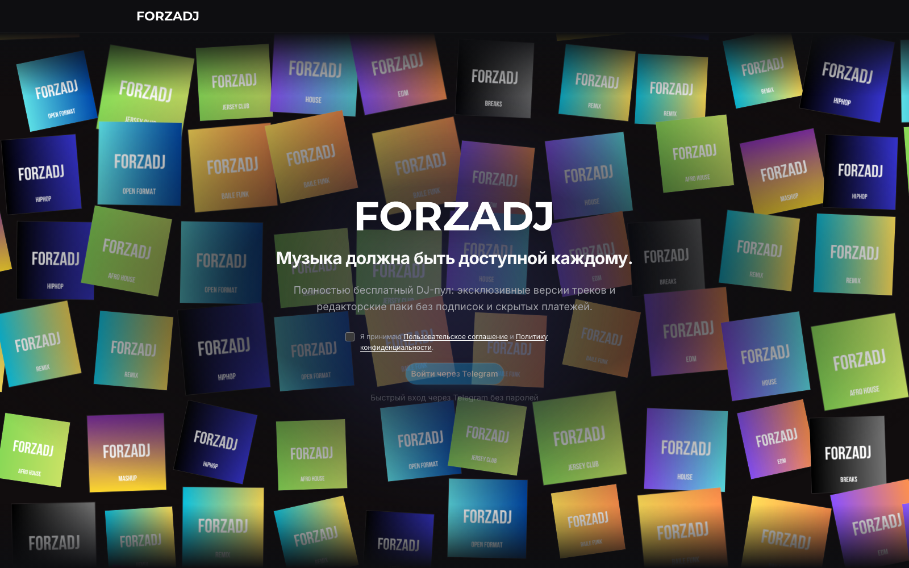
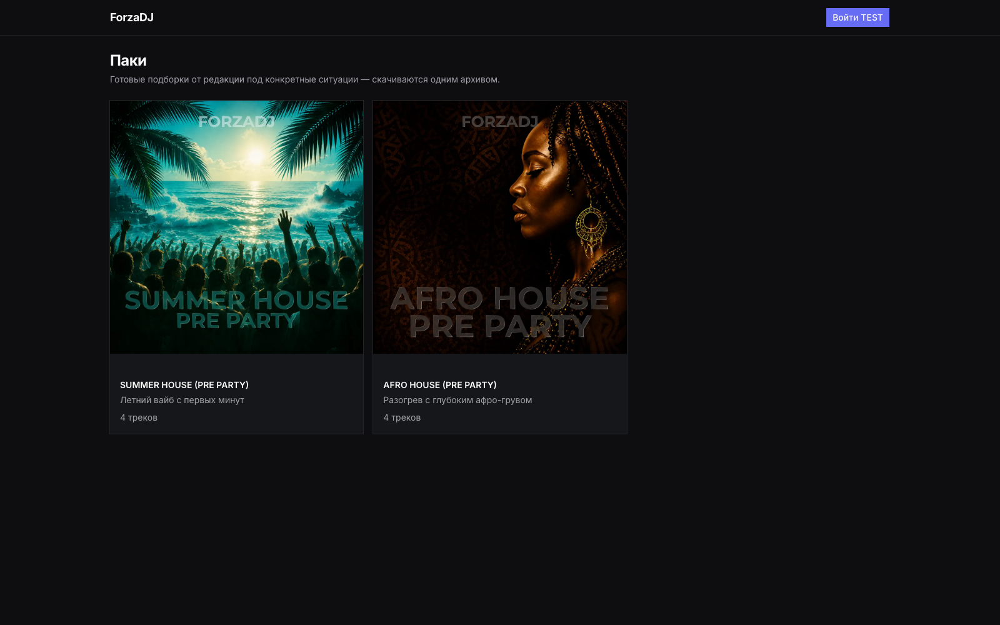

<div align="center">

# ForzaDJ

**Free DJ pool platform — download exclusive tracks without subscriptions**

[](https://nextjs.org)
[](https://www.typescriptlang.org)
[](https://tailwindcss.com)
[](https://www.prisma.io)
[](https://supabase.com)
[](https://www.postgresql.org)
[](LICENSE)
[]()

[**Live Demo →**](https://forzadj.ru) · [Admin Bot →](https://github.com/hamidkazimov777-cmd/forzadj-admin-bot) · [Report Bug](https://github.com/hamidkazimov777-cmd/forzadj/issues)

</div>

---

## Screenshots

| Landing | Editorial Packs |
|:-------:|:----------------:|
|  |  |

---

## Overview

ForzaDJ is a full-stack DJ pool platform where DJs can discover, preview, and download exclusive tracks — without subscriptions or hidden fees. The platform runs on a voluntary donation model.

**Highlights:**
- Full audio pipeline — preview generation, waveform visualization, BPM/Key auto-detection
- Telegram authentication — no passwords, one-tap login
- Three-tier role system — DJ, Admin, Super Admin
- Integrated [Telegram Admin Bot](https://github.com/hamidkazimov777-cmd/forzadj-admin-bot) for one-command AI-powered content publishing
- Dark-only UI with a global mini-player that persists across navigation

---

## Architecture

```
┌─────────────────────────────────────────────────────────┐
│                  forzadj.ru  (VPS + PM2)                │
│                                                         │
│  Next.js 15  App Router                                 │
│  ├── (public)/          Landing page                    │
│  ├── (dj)/              Authenticated DJ zone           │
│  │   ├── /pool          Track catalog + filters         │
│  │   ├── /dashboard     Post-login home                 │
│  │   ├── /collections   Personal crates                 │
│  │   └── /charts        Auto-generated charts           │
│  ├── (studio)/          Admin content management        │
│  └── api/               REST endpoints                  │
│       ├── /bot/upload   ← Admin Bot integration         │
│       ├── /stream       Preview MP3 streaming           │
│       ├── /download     Signed download URLs            │
│       └── /artwork      WebP-optimized covers           │
│                                                         │
│  Inline Job Queue (no Redis, no external dependencies)  │
│  ├── asset.process    Preview MP3 + waveform + BPM/Key  │
│  └── artwork.optimize WebP variants via Sharp (4 sizes) │
└──────────────┬──────────────────────────────────────────┘
               │
   ┌───────────┴────────────┐
   │       Supabase         │
   │  Auth v1 (magic-link)  │
   │  Storage (3 buckets)   │
   │  PostgreSQL 16         │
   └────────────────────────┘
```

**Admin Bot ↔ Platform** — two independent services communicate through a secret-authenticated HTTP endpoint (`POST /api/bot/upload`). The bot handles content ingestion; the platform handles storage, processing, and delivery.

---

## Tech Stack

| Layer | Technology |
|-------|-----------|
| Framework | Next.js 15.5 — App Router, Server Components, Turbopack |
| Language | TypeScript 5 |
| Styling | Tailwind CSS v4 · shadcn/ui (Radix UI primitives) |
| ORM | Prisma 7 with `PrismaPg` driver adapter |
| Database | PostgreSQL 16 via Supabase |
| Auth | Supabase Auth v1 (magic-link OTP) |
| Storage | Supabase Storage — `audio`, `previews`, `artwork` buckets |
| Audio analysis | Essentia.js (WebAssembly) — BPM, musical key, Camelot Wheel |
| Audio processing | FFmpeg — preview MP3, waveform peaks JSON, cover art embedding |
| Image processing | Sharp 0.35 — WebP variants at 1200 / 600 / 300 / 120 px |
| ZIP bundles | archiver v8 (ESM) |
| Icons | lucide-react |
| Notifications | sonner |
| Deploy | VPS + PM2 · GitHub Actions → SSH |

---

## Features

### For DJs
- **Catalog** — filter by genre, BPM range, Camelot key, mood, version type; full-text search
- **Global mini-player** — plays full tracks; survives page navigation without interruption
- **Preview streaming** — 30-second no-auth previews; full playback after login
- **Downloads** — original MP3 files via signed URLs; rate-limited (75/day, 2 per track)
- **Crates** — personal + public playlists with shareable `/c/[slug]` links
- **Editorial packs** — curated ZIP collections, downloadable in one click
- **Charts** — auto-generated weekly charts based on download counts
- **Dashboard** — personalized home with stats, new releases, download history

### For Admins (Studio)
- **Track upload** — batch upload with immediate audio analysis
- **Metadata editor** — title, artists, genres, BPM, Camelot, energy, mood, version type
- **One-command publishing** — via Telegram Admin Bot with AI classification
- **Editorial packs** — create curated collections with custom covers
- **User management** — role assignment (Super Admin only)

### Audio Pipeline
- BPM and musical key detection via **Essentia.js (WASM)** — runs in Node.js, no Python dependency
- MP3 preview generation (30 s) and peak waveform JSON via **FFmpeg**
- Artwork optimization — 4 WebP sizes generated asynchronously via **Sharp**
- WebP content negotiation — `Accept: image/webp` aware, `Vary: Accept` header set
- Signed download URLs (60 s TTL) with daily and per-track quotas
- Downloadable MP3 includes branded cover art embedded in ID3 tags via FFmpeg

### Authentication
- **Telegram Login Widget** — HMAC-verified browser login
- **Telegram Bot deep-link** — one-tap login via `t.me/<bot>?start=<nonce>`
- Both flows share a single `issueTelegramSession()` function
- Supabase Auth magic-link OTP under the hood — no passwords stored

---

## Getting Started

### Prerequisites

- Node.js 20+
- npm
- FFmpeg in `PATH`
- A [Supabase](https://supabase.com) project (free tier works for development)
- A Telegram Bot token from [@BotFather](https://t.me/BotFather)

### Installation

```bash
git clone https://github.com/hamidkazimov777-cmd/forzadj.git
cd forzadj

npm_config_cache=.npm-cache npm install

cp .env.example .env
# fill in your values — see the table below
```

### Database setup

```bash
npx prisma migrate deploy   # apply all migrations
npx prisma generate         # generate Prisma client
```

### Run development server

```bash
npm run dev
# → http://localhost:3000
```

### Build for production

```bash
npm run build
npm start
```

---

## Environment Variables

Copy `.env.example` and fill in your values:

```bash
cp .env.example .env
```

| Variable | Required | Description |
|----------|:--------:|-------------|
| `DATABASE_URL` | ✅ | Supabase Postgres pooler URL (pgbouncer, port 6543) |
| `DIRECT_URL` | ✅ | Direct Postgres URL (port 5432) — used by `prisma migrate` |
| `NEXT_PUBLIC_SUPABASE_URL` | ✅ | Your Supabase project URL |
| `NEXT_PUBLIC_SUPABASE_ANON_KEY` | ✅ | Supabase anon public key |
| `SUPABASE_SERVICE_ROLE_KEY` | ✅ | Supabase service role key (server-only, never expose to client) |
| `TELEGRAM_BOT_TOKEN` | ✅ | Bot token from @BotFather |
| `NEXT_PUBLIC_TELEGRAM_BOT_USERNAME` | ✅ | Bot username without `@` |
| `FORZADJ_OWNER_TELEGRAM_ID` | ✅ | Your Telegram numeric ID — granted SUPER_ADMIN on first login |
| `BOT_UPLOAD_SECRET` | ✅ | Shared secret with Admin Bot (min. 32 random chars) |
| `NEXT_PUBLIC_APP_URL` | ✅ | Canonical origin (`https://yourdomain.com`) |
| `STORAGE_BUCKET_AUDIO` | — | Bucket name, default `audio` |
| `STORAGE_BUCKET_PREVIEWS` | — | Bucket name, default `previews` |
| `STORAGE_BUCKET_ARTWORK` | — | Bucket name, default `artwork` |
| `DOWNLOAD_DAILY_LIMIT` | — | Downloads per user per day, default `75` |
| `DOWNLOAD_MAX_PER_TRACK` | — | Max downloads per track per user, default `2` |

> **Security:** `SUPABASE_SERVICE_ROLE_KEY` and `BOT_UPLOAD_SECRET` must never be prefixed with `NEXT_PUBLIC_`.

---

## Project Structure

```
forzadjbeta/
├── prisma/
│   ├── schema.prisma           # DB schema — single source of truth
│   └── migrations/             # 15 versioned migrations
├── src/
│   ├── app/
│   │   ├── (public)/           # Landing page + legal pages
│   │   ├── (dj)/               # Authenticated DJ zone (middleware-protected)
│   │   │   ├── dashboard/
│   │   │   ├── pool/           # Track catalog
│   │   │   ├── collections/    # Personal crates
│   │   │   └── charts/
│   │   ├── (shared)/           # Public routes without strict auth
│   │   │   └── packs/          # Editorial packs showcase
│   │   ├── (studio)/           # Admin zone (ADMIN+ only, 404 for others)
│   │   │   └── studio/
│   │   │       ├── tracks/     # Upload + metadata editor
│   │   │       ├── collections/# Editorial packs management
│   │   │       └── users/      # Role management (SUPER_ADMIN)
│   │   └── api/
│   │       ├── bot/upload/     # Admin Bot integration endpoint
│   │       ├── stream/         # Preview MP3 streaming
│   │       ├── download/       # Signed download delivery
│   │       └── artwork/        # WebP-optimized cover serving
│   ├── components/
│   │   ├── player/             # Global mini-player + waveform
│   │   ├── tracks/             # TrackList, DownloadButton, FavoriteButton
│   │   ├── studio/             # TrackUploader, GenrePicker, metadata forms
│   │   └── ui/                 # shadcn/ui primitives
│   ├── server/
│   │   ├── auth/               # Session management, permissions, Telegram providers
│   │   ├── jobs/               # Inline job queue + handlers
│   │   │   └── handlers/
│   │   │       ├── asset-process.ts     # Preview + waveform + BPM/Key
│   │   │       └── artwork-optimize.ts  # WebP variants via Sharp
│   │   ├── repositories/       # Prisma data access layer
│   │   └── storage/            # Supabase Storage adapter
│   └── middleware.ts           # DJ-zone session guard
├── .github/
│   └── workflows/deploy.yml    # CI: push main → SSH → pm2 restart
└── .env.example
```

---

## Deployment

Runs on a VPS with **PM2**, deploying automatically on every push to `main` via **GitHub Actions** over SSH.

```bash
# Manual deploy
git pull origin main
npm_config_cache=.npm-cache npm install
npm run build
pm2 restart forzadj
```

### Supabase Storage buckets

Create three buckets in your Supabase project:

| Bucket | Access | Contents |
|--------|--------|----------|
| `audio` | Private | Original track files |
| `previews` | Private | Preview MP3s + waveform JSON |
| `artwork` | Public | Track covers + WebP variants |

---

## Database Schema

Key entities:

```
tracks
  ├── track_artists    (MAIN | FEATURED | REMIXER)
  ├── track_genres     (position 0 = primary genre)
  └── track_versions   (ORIGINAL | EXTENDED | REMIX | MASHUP)
       └── assets      (ORIGINAL | PREVIEW | WAVEFORM | ARTWORK)

collections  (CRATE | EDITORIAL | CHART)
users        (DJ | ADMIN | SUPER_ADMIN)
donations    → donation_events, donation_rewards
```

- UUIDs v7 everywhere (time-sortable, URL-safe)
- Soft delete on all content tables (`deleted_at`)
- Partial unique indexes on slugs (`WHERE deleted_at IS NULL`)

---

## Roadmap

- [x] Telegram authentication (Login Widget + Bot deep-link)
- [x] Track catalog with filters (genre, BPM, Camelot key, mood, version)
- [x] Global mini-player with waveform visualization
- [x] BPM and Camelot Key auto-detection via Essentia.js (WASM)
- [x] Signed download URLs with rate limiting (75/day, 2/track)
- [x] Studio — upload, metadata editor, publication
- [x] Editorial packs with ZIP download
- [x] Personal crates with public sharing
- [x] Auto-generated weekly charts
- [x] Post-login personalized dashboard
- [x] WebP artwork optimization — 4 sizes via Sharp
- [x] CI/CD — GitHub Actions → VPS + PM2
- [x] Admin Telegram Bot with AI-powered content publishing
- [ ] Donation payment integration (Telegram Stars / YooKassa)
- [ ] Email notifications — new releases for pack subscribers
- [ ] Studio analytics dashboard
- [ ] External job queue (Redis + BullMQ) for high load
- [ ] Mobile application

---

## Related

**[ForzaDJ Admin Bot](https://github.com/hamidkazimov777-cmd/forzadj-admin-bot)** — Telegram bot for one-command track publishing. Receives MP3 → extracts metadata → AI genre/mood classification via Groq → selects branded artwork → publishes to the platform via a secret-authenticated API. Built with grammY, TypeScript, and Groq `llama-3.3-70b-versatile`.

---

## Author

**Hamid Kazimov**

[](https://t.me/hamidkazimov)
[](https://github.com/hamidkazimov777-cmd)

---

## License

MIT © 2026 Hamid Kazimov
